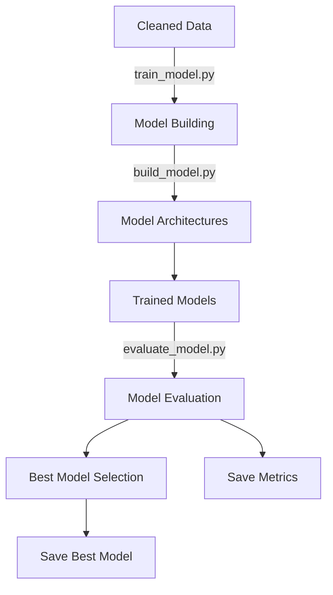

# Models Module

This module handles the complete model building, training, and evaluation pipeline for customer review sentiment analysis.

## Overview

The models module consists of three main components that work together to create, train, and evaluate sentiment analysis models:

1. **Model Building** - Construct various ML/DL architectures
2. **Model Training** - Train models with proper data preparation and callbacks
3. **Model Evaluation** - Assess performance and select the best model

## Files

### `build_model.py`

Provides a flexible framework for building various machine learning and deep learning models.

**Key Features:**
- Build LSTM (Long Short-Term Memory) models for sequence-based classification
- Build CNN (Convolutional Neural Network) models for text pattern recognition
- Build hybrid CNN-LSTM models combining convolutional and recurrent architectures
- Build traditional Logistic Regression models for baseline comparisons
- Dynamically configure embedding layers with:
  - Pre-trained embedding matrices (Word2Vec, GloVe, etc.)
  - Trainable embeddings learned from scratch
  - Custom vocabulary sizes and embedding dimensions
- Support flexible configurations via YAML files or Python dictionaries

**Main Class:** `ModelBuilder`

**Supported Model Types:**
- `lstm` - Long Short-Term Memory neural network
- `cnn` - Convolutional Neural Network
- `cnn_lstm` - Hybrid CNN-LSTM architecture
- `logistic_regression` - Traditional ML baseline

**Usage:**
```python
from src.models.build_model import ModelBuilder

# Initialize with config file
builder = ModelBuilder(config_path="configs/config.yaml")

# Or with config dictionary
builder = ModelBuilder(config_dict={"lstm_model": {...}})

# Build a specific model
lstm_model = builder.build_model("lstm", show_summary=True)
cnn_model = builder.build_model("cnn")
lr_model = builder.build_model("logistic_regression")
```

**Configuration:**
Each model type has its own configuration section in the YAML:
- `embedding`: Embedding layer parameters (num_words, embedding_dim, trainable)
- `compile`: Compilation parameters (loss, optimizer, metrics)
- Model-specific hyperparameters (dropout rates, layer sizes, etc.)

---

### `train_model.py`

Provides comprehensive training capabilities for multiple machine learning models.

**Key Features:**
- Train multiple model types (LSTM, CNN, CNN-LSTM, Logistic Regression)
- Automatic data preparation based on model type:
  - Vector-based inputs for traditional ML models
  - Sequence-based inputs for deep learning models
- Configure training parameters via YAML (epochs, batch size, validation split)
- Support for Keras callbacks (EarlyStopping, ModelCheckpoint, ReduceLROnPlateau)
- Persist trained models in appropriate formats (.h5 for Keras, .pkl for scikit-learn)
- Batch training of multiple models with a single method call

**Main Class:** `ModelTrainer`

**Usage:**
```python
from src.models.train_model import ModelTrainer
from src.data.clean_data import CleanData

# Load and clean data
df = CleanData().clean_data()

# Initialize trainer
trainer = ModelTrainer(
    dataframe=df,
    yaml_config_path="configs/config.yaml",
    target_column="label"
)

# Train a specific model
lstm_model = trainer.train_model("lstm")

# Or train all models defined in config
all_models = trainer.train_all_models()
```

**Methods:**
- `train_model(model_type, custom_params)`: Train a specific model type
- `train_all_models()`: Train all models defined in the configuration
- `_prepare_data(model_type)`: Automatically prepare data for the specific model
- `_setup_callbacks(cfg)`: Configure training callbacks

**Configuration:**
The module uses configuration from `configs/config.yaml`:
- `data_ingestion.clean_data_file`: Path to cleaned data
- `model_training`: Training parameters (epochs, batch_size, validation_split)
- `callbacks`: Callback configurations (EarlyStopping, ModelCheckpoint, etc.)

---

### `evaluate_model.py`

Provides comprehensive evaluation capabilities for trained models.

**Key Features:**
- Compute standard classification metrics:
  - Accuracy - overall correctness
  - Precision - positive predictive value (weighted average)
  - Recall - sensitivity/true positive rate (weighted average)
  - F1 Score - harmonic mean of precision and recall (weighted average)
- Compare multiple trained models using consistent metrics
- Identify the best-performing model based on accuracy
- Save evaluation results to JSON files
- Save the best model in appropriate format (.h5 for Keras, .pkl for scikit-learn)

**Main Class:** `ModelEvaluator`

**Usage:**
```python
from src.models.evaluate_model import ModelEvaluator
from src.models.train_model import ModelTrainer
from src.data.clean_data import CleanData

# Train models
df = CleanData().clean_data()
trainer = ModelTrainer(df, "config.yaml", target_column="label")
trained_models = trainer.train_all_models()

# Evaluate all models
evaluator = ModelEvaluator()
results = {}

for name, model in trained_models.items():
    metrics = evaluator.evaluate(
        model, 
        trainer.X_test, 
        trainer.y_test, 
        name
    )
    results[name] = metrics

# Get best model
best_model_name, best_metrics = evaluator.get_best_model(results)
best_model_obj = trained_models[best_model_name]

# Save results and best model
evaluator.save_results(results)
evaluator.save_best_model(best_model_name, best_model_obj)
```

**Methods:**
- `evaluate(model, X_test, y_test, model_name)`: Compute metrics for a model
- `get_best_model(results)`: Select best model based on accuracy
- `save_results(results, output_dir)`: Save evaluation metrics to JSON
- `save_best_model(best_model_name, best_model_obj, output_dir)`: Persist the best model

## Workflow



1. **Model Building**: Use `build_model.py` to define model architectures
2. **Model Training**: Use `train_model.py` to train multiple models with proper data preparation
3. **Model Evaluation**: Use `evaluate_model.py` to assess performance and select the best model
4. **Persistence**: Best model and metrics are saved for deployment

## Model Comparison

| Model Type | Use Case | Input Type | Strengths |
|------------|----------|------------|-----------|
| **Logistic Regression** | Baseline | Vectors | Fast, interpretable, good baseline |
| **LSTM** | Sequential patterns | Sequences | Captures long-term dependencies |
| **CNN** | Local patterns | Sequences | Detects n-gram features |
| **CNN-LSTM** | Hybrid approach | Sequences | Combines feature extraction + sequence modeling |

## Dependencies

- TensorFlow/Keras
- scikit-learn
- numpy
- pandas

## Output Artifacts

After training and evaluation, the following artifacts are created:

- `artifacts/trained_models/*.h5` - Trained Keras models
- `artifacts/trained_models/*.pkl` - Trained scikit-learn models
- `artifacts/evaluation/metrics.json` - Evaluation metrics for all models
- `artifacts/best_model/best.h5` or `best.pkl` - The best-performing model

## Logging & Error Handling

All modules use:
- Custom logger from `src.utils.logger`
- Custom exception handling from `src.utils.exception`
- Configuration parsing from `src.utils.config_parser`

All operations include comprehensive logging with emoji indicators for better readability (📊 for metrics, 🏆 for best model, 💾 for saves, ❌ for errors).
