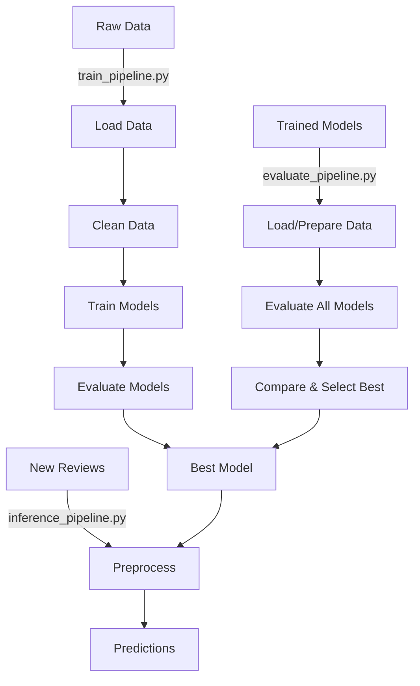

# Pipeline Module

This module provides end-to-end orchestration of the complete machine learning workflow for customer review sentiment analysis, from data loading through model training, evaluation, and inference.

## Overview

The pipeline module consists of three main orchestration components:

1. **Training Pipeline** - Complete workflow for data loading, cleaning, model training, and evaluation
2. **Evaluation Pipeline** - Comprehensive model comparison and best model selection
3. **Inference Pipeline** - Production-ready predictions with trained models

## Files

### `train_pipeline.py`

Orchestrates the complete end-to-end training workflow with configurable stages.

**Key Features:**
- Execute multiple pipeline stages in configurable sequence:
  - Data ingestion (downloading and loading raw data)
  - Data cleaning (preprocessing, tokenization, vectorization)
  - Model training (one or more ML/DL models)
  - Model evaluation (metrics and best model selection)
- Load pipeline configuration from YAML files
- Coordinate data flow between pipeline stages
- Execute selective or complete workflows based on configuration
- Handle errors gracefully with comprehensive logging

**Main Class:** `TrainingPipeline`

**Pipeline Stages:**
1. `load_data` - Download and extract raw review data
2. `clean_data` - Preprocess and vectorize text
3. `train_model` - Train specified model type
4. `evaluate_model` - Compute metrics and save best model

**Usage:**
```python
from src.pipeline.train_pipeline import TrainingPipeline

# Initialize with config
pipeline = TrainingPipeline(
    pipeline_config_path="configs/pipeline_params.yaml"
)

# Run the complete pipeline
pipeline.run()
```

**Configuration:** `configs/pipeline_params.yaml`
```yaml
training_pipeline:
  pipeline:
    stages:
      - load_data
      - clean_data
      - train_model
      - evaluate_model
  training:
    config_path: "configs/config.yaml"
    target_column: "label"
    model_type: "lstm"
  evaluation:
    save_dir: "artifacts/evaluation"
    best_model_dir: "artifacts/best_model"
```

---

### `evaluate_pipeline.py`

Provides comprehensive evaluation capabilities for comparing multiple models and selecting the best performer.

**Key Features:**
- Load or prepare cleaned data automatically:
  - Load pre-processed data from disk if available
  - Run data cleaning pipeline if data is missing
- Load trained models or trigger training if needed:
  - Load existing models from artifacts directory
  - Train multiple models automatically if configured
- Evaluate all models on consistent test data
- Compute standard classification metrics (accuracy, precision, recall, F1)
- Compare models and identify best performer based on accuracy
- Save comprehensive evaluation results:
  - Metrics for all models in JSON format
  - Best-performing model for production deployment

**Main Class:** `EvaluationPipeline`

**Usage:**
```python
from src.pipeline.evaluate_pipeline import EvaluationPipeline

# Initialize with config
pipeline = EvaluationPipeline(
    pipeline_config_path="configs/pipeline_params.yaml"
)

# Run evaluation
pipeline.run()
```

**Methods:**
- `run()`: Execute complete evaluation pipeline
- `_load_or_prepare_data()`: Load data from disk or run cleaning
- `_load_models(df)`: Load trained models or train new ones

**Configuration Options:**
- `data.clean_data_file`: Path to cleaned data
- `data.auto_clean`: Automatically run cleaning if data missing
- `models.load_existing`: Load models from artifacts directory
- `models.auto_train`: Train models if they don't exist
- `evaluation.save_dir`: Directory for evaluation results

---

### `inference_pipeline.py`

Production-ready inference pipeline for making predictions with trained models.

**Key Features:**
- Load trained models (.h5 for deep learning, .pkl for traditional ML)
- Preprocess new review inputs using the same cleaning pipeline
- Support both single-sample and batch inference:
  - Single review prediction
  - Batch processing with custom separators
- Generate sentiment predictions (positive/negative)
- Return structured DataFrames with input text and predictions
- Optionally save prediction results to CSV
- Handle errors gracefully with comprehensive logging

**Main Class:** `InferencePipeline`

**Usage:**

**Single Sample Prediction:**
```python
from src.pipeline.inference_pipeline import InferencePipeline

# Initialize
pipe = InferencePipeline(config_path="configs/pipeline_params.yaml")

# Predict on single review
result = pipe.run(
    title="Great product!",
    text="I love this item. Highly recommended.",
    batch_mode=False
)

print(result)
# Output: DataFrame with columns [title, text, prediction]
```

**Batch Prediction:**
```python
# Batch mode with separator
titles = "Amazing product|||Terrible quality|||Just okay"
texts = "Love it!|||Waste of money|||It's fine"

results = pipe.run(
    title=titles,
    text=texts,
    batch_mode=True
)

print(results)
# Output: DataFrame with multiple rows
```

**Methods:**
- `run(title, text, batch_mode)`: Run inference on single or batch input
- `_load_model()`: Load trained model from disk
- `_predict(df)`: Generate predictions based on model type

**Configuration:**
- `inference.model_path`: Path to trained model (.h5 or .pkl)
- `inference.separator`: Separator for batch inputs (default: "|||")
- `inference.save_results`: Save predictions to CSV

---

### `predict_pipeline.py`

> **Note:** This file appears to be empty or deprecated. Use `inference_pipeline.py` for production inference.

## Complete Workflow



## Pipeline Comparison

| Pipeline | Purpose | Input | Output | Use Case |
|----------|---------|-------|--------|----------|
| **Training Pipeline** | End-to-end training | Raw data URL | Trained models + metrics | Initial model development |
| **Evaluation Pipeline** | Model comparison | Trained models + data | Best model + metrics | Model selection & benchmarking |
| **Inference Pipeline** | Production predictions | New reviews | Sentiment predictions | Production deployment |

## Usage Scenarios

### Scenario 1: Complete Training from Scratch
```python
from src.pipeline.train_pipeline import TrainingPipeline

pipeline = TrainingPipeline("configs/pipeline_params.yaml")
pipeline.run()
# Runs: load_data → clean_data → train_model → evaluate_model
```

### Scenario 2: Evaluate Multiple Pre-Trained Models
```python
from src.pipeline.evaluate_pipeline import EvaluationPipeline

pipeline = EvaluationPipeline("configs/pipeline_params.yaml")
pipeline.run()
# Compares all models and selects best
```

### Scenario 3: Production Inference
```python
from src.pipeline.inference_pipeline import InferencePipeline

pipe = InferencePipeline("configs/pipeline_params.yaml")
predictions = pipe.run(
    title="Product title",
    text="Product review text"
)
```

## Configuration Files

All pipelines use YAML configuration files:

- `configs/pipeline_params.yaml` - Main pipeline configuration
  - Training pipeline stages and parameters
  - Evaluation pipeline options
  - Inference pipeline settings

- `configs/config.yaml` - Model and data configuration
  - Data ingestion paths
  - Model architectures and hyperparameters
  - Training callbacks and parameters

## Output Artifacts

### Training Pipeline Outputs:
- `artifacts/data/raw/` - Downloaded raw data
- `artifacts/data/processed/` - Cleaned and vectorized data
- `artifacts/trained_models/` - Trained model files
- `artifacts/evaluation/metrics.json` - Evaluation metrics
- `artifacts/best_model/` - Best performing model

### Evaluation Pipeline Outputs:
- `artifacts/evaluation/metrics.json` - Comprehensive metrics for all models
- `artifacts/best_model/` - Selected best model

### Inference Pipeline Outputs:
- Console output with predictions
- Optional CSV file with prediction results

## Dependencies

- All data module components (`load_data`, `clean_data`)
- All model module components (`build_model`, `train_model`, `evaluate_model`)
- TensorFlow/Keras (for deep learning models)
- scikit-learn (for traditional ML models)
- pandas, numpy

## Logging & Error Handling

All pipelines use:
- Custom logger from `src.utils.logger`
- Custom exception handling from `src.utils.exception`
- Comprehensive emoji-based logging for readability:
  - 🔧 Initialization
  - 🚀 Pipeline start
  - ▶️ Stage execution
  - ✅ Successful completion
  - ❌ Errors
  - 🏁 Final completion
  - 🎉 Full success

## Best Practices

1. **Development**: Use `train_pipeline.py` for initial model development and experimentation

2. **Model Selection**: Use `evaluate_pipeline.py` to compare multiple models and select the best

3. **Production**: Use `inference_pipeline.py` for real-time predictions in production

4. **Configuration**: Keep all pipeline parameters in YAML files for easy experimentation without code changes

5. **Selective Execution**: Modify pipeline stages in config to skip unnecessary steps (e.g., skip data loading if data already exists)
